% ---
% layout: default
% title: Git Tutorial
% parent: 1. Background Info
% grand_parent: GitHub and GitHub Pages
% has_children: false
% nav_order: 1
% ---

# Introduction to Git

*Created by [Ishank Lakhmani](https://github.com/ishanklakhmani97)*

## 1. What is Git?
Git is an open source distributed file system which is used for tracking, storing and also reverting to older versions of a code. Every time a code is ‘pushed’ into a repository, it is called a ‘commit’ and this means that a new version of the code has been created and added to the repository. This repository can be shared among different people to track the latest version of a code and also get older versions, if needed.


## 2. Git vs Github?
Git is a version control system which is used to store, track and monitor any changes to the code. Github is a cloud based repository that helps us perform the version control where everyone can use this cloud based platform to monitor the data from different


## 3. How does git work?
Git stores the file we need to be saved in a repository. Like mentioned above, when we want to save our code in git, it is called a commit. A commit is like a snapshot of current files. All these files of different versions are linked to one another, forming a link between each file so we can choose any file or version we would like to pull (retrieve) .


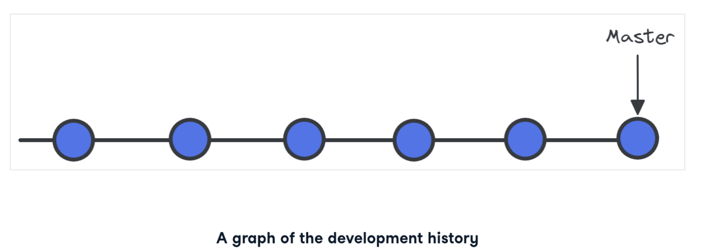

## 4. Branches in git
Branches are copies of code that work in parallel with the main version. This reduces dependency on the prior code. Each individual can work on their version of the code without interference from any other colleague. Finally any branch created can be merged back to the ‘master’ branch.


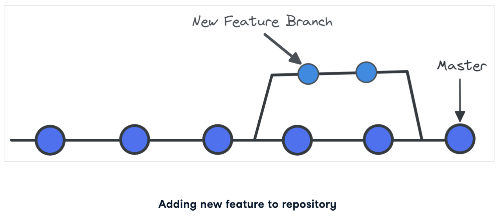

## What are branches in git?

If we already have a version of the code which is working and we want to make changes on top of that, it is not the best idea to directly start working on the same production file right away. This would cause unexpected problems and we might end up losing our working code. Branching can be used to avoid this sort of problem.

Branches are extremely valuable in certain scenarios, like -
- A team is working on multiple things at the same time and there could be conflicts in changes and versions which could lead to a major confusion,
- When one version of the code is ready and we need to make changes to it, we need to be sure that we have the working copy of the code and do not lose that. Branches help keep older versions so we do not lose it when making changes too.

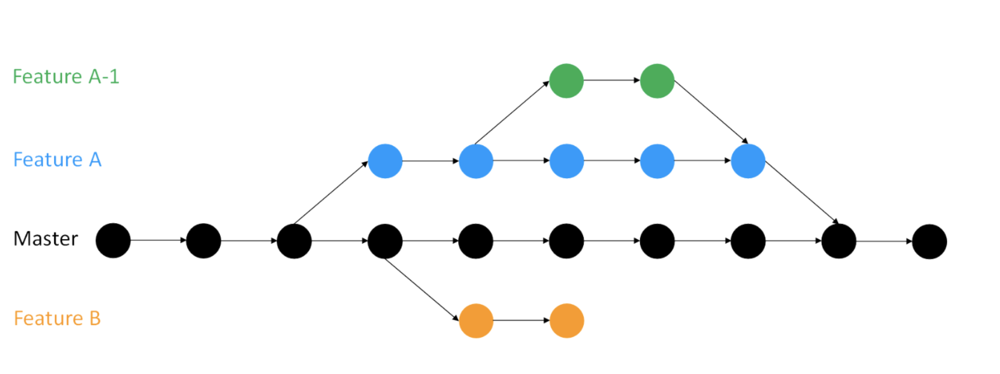


As we can see from above, branches can be replicated and be worked on simultaneously without touching the master code and later, be converged with the Master.

We can see all branches using the code -


## 5. Commits in Git
In github, commits are like checkpoints which can be published and tell us where code can be directly reverted from safely. There is an option to store any commit with a comment for the reference of the team. We can have multiple commits and go back to each commit to compare our code without cluttering the different directories and codes.

### Getting Started with Git
To use git first we need to install it in our machine (Mac, Windows or Linux). We can install it using the link [here](https://link-url-here.org).

### Most common git commands -

### Initialization
To start our github repository, we need to run a few commands to control the repository and the code in it. This command should be run from the directory that contains all files for the repository. The first one is the initialization command -

```
git init
```

This command just needs to be run once when we are creating a project.
### Add
The command below is to add all current files to the git repository. This command should especially be run if files already exist in your initialized repository -

```
git add .
```

**Note:** The '.' here will add all files in the directory into the initialized repository.

Or we can also add a specific file to our repo by using the command below -

```
git add file_name
```

Once we add files, all the files have been added to the ‘staging area’. Files need to be added to the staging area before performing a commit and storing our files into a newer version of the code.


### Status
The status command will give us a good idea about which files have been modified, but not saved in changes in our repository.

```
git status
```


### Commit
The commit command is used to save the code or file in our repository and is therefore moved out of the staging area, and added to our repository with another version of the file.

```
git commit
```


### Commit with message

The commit command can also be used with a message about the change in this version over another, or any other message we need on this version -


```
git commit -m 'message about new version here'
```


We can also see the log of the previous commits using the command -

```
git log
```


Usually it is best practice to write messages on git in present tense.


How do we check versions and retrieve them?

To cancel our latest commit -

```
git revert HEAD
```


The above command creates a commit that reverts the changes of the last commit.
Also, if we need to retrieve any older versions of data, then we can look them up using our log, get their SHA ID and use that to -

```
git checkout SHA_of_the_version
```


Git practices should always be ‘atomic’, meaning it should have only a specific number of changes and it should have all the code related to those changes. This is because if there are multiple changes in one commit, then it might be difficult to understand the problem in case of an error.

It is always good practice to specify the file being committed, which means adding the files to the staging area, rather than adding everything. This prevents us from bundling everything together.

### Comparing different versions

There might be times when we would want to compare different versions to check which one gave us a specific result we needed. For this we can compare the different versions using git commands. To address this issue, we can use git diff and then the name of both the files which shows the difference in both files. More specifically -


```
git diff thing_one thing_two
```


We can also compare two differences in branches using -

```
git diff branch_one branch_two
```


Another good practice is to compare two related files. We would want to compare two files which make sense, rather than two random files, as we may not understand and make changes on the files we did not want to compare.

### Branches

We can see all branches using the code -

```
git branch
```


We can create a new branch and move towards it using -

```
git checkout -b name_of_new_branch
```


Or directly switch to a new branch -

```
git checkout name_of_new_branch
```


Any work being done in a branch must be committed before we move to another branch else the progress will not be saved.

Finally a branch can be deleted using the command -

```
git branch -D name_of branch_to_be_deleted
```


## 6. Step by Step Tutorial

- Make a directory in git - command - `mkdir`

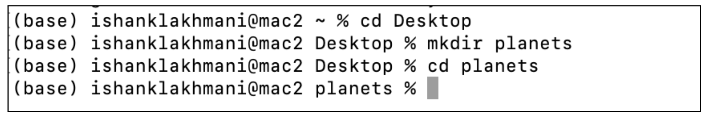

Here we created a directory in the Desktop called **planets**. Navigate to this directory with `cd` as shown above and we use `mkdir` to create a new directory.

- Initializing Git - `git init`

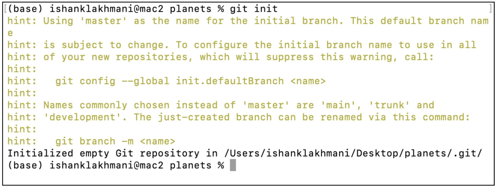

We can see above that **planets** has been initialized as a Git repository using `git init` command and **master** has been assigned as our default branch, since we did not mention a default branch explicitly.

- Checking if a git repo has been created - `ls -a`

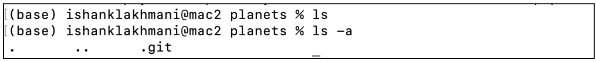


As we can see from above, when we use the command ls, no files show up, but instead when we use `ls -a`, we can see that a git repository has been created. This file is a hidden file and cannot be seen by using just a `ls` command, to see all files (including hidden files, like the **.git** file) we need to use the `ls -a` command.

- Switching to a different branch - `git checkout -b`

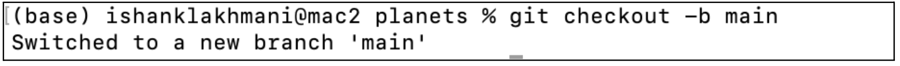

Switching to a new branch called **main** using the above command.

- Checking the status of the repository - `git status`

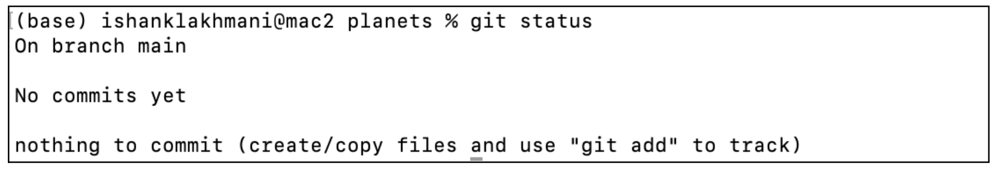

We can see above that the status gives us an idea about the number of branches and their name(s). Along with that it also shows the number of commits. There is currently nothing to commit.

- Creating a text file - `nano`

We can open files and edit them from the command line with nano. Install nano here:
https://www.nano-editor.org/

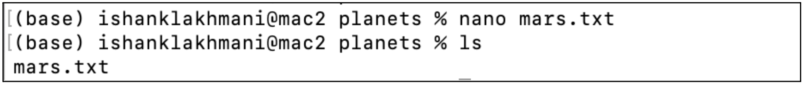

The above command created a text file named **mars.txt**. With nano, we can add text to this file. Add the text: ‘Cold and dry but everything is my favorite color.’ We can see the contents using the following command:


- Check status of modified file - `git status`

We can see the status of the new file using the `git status` command and it shows us that there are now untracked files.

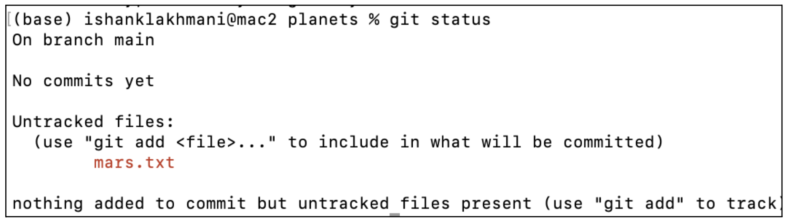

- Add file to git - `git add mars.txt`

Using this we can add the file to the git repository and check for status again -

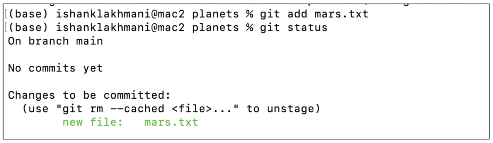

We can see here that once we add the file, using the `add` command, the status of the file has changed from untracked to staged.

- Committing the file to the git repository - `git commit -m`

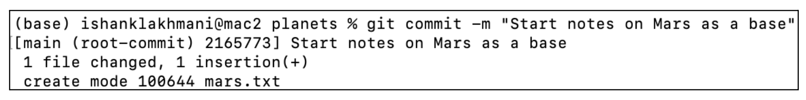

Using the `git commit -m 'message to be inserted'`, we can commit the changes and add the files to our git repository. As we can see above, we have kept the message - “Start notes on Mars as a base” in our commit statement.

- Checking the status of the repository -

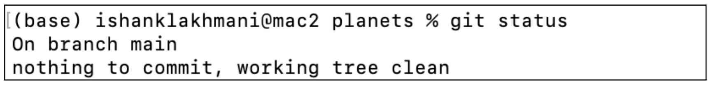

We can see above that there is one branch and no files which can be kept on commit.

- Checking log of the repository - `git log`

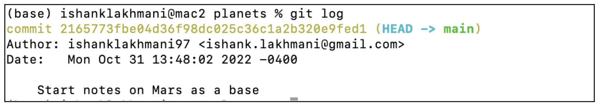

We can see the log where we have made a commit, it shows the name of the author, time of commit and message attached in the commit.

- Making changes to a file - `git diff`


We now will make changes to our text file, and then check the status where we can see that it shows changes not staged. Using the command `git diff`, we will get the difference in the two files. As we can see below -

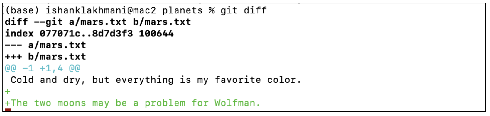

We can see from above that the difference is in green color, showing the difference between the files before and after the changes.


- Adding file to git and committing Changes - `git add`

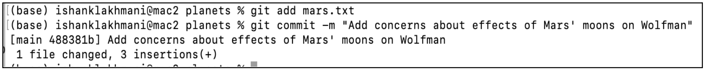

We can see that the file can be readded and committed with a new message.

- Check difference between staged file and committed file - `git diff --staged`

After adding another line to our file, if we add it to git (using `git add`) and check for differences just using `git diff`, it will not show any output -

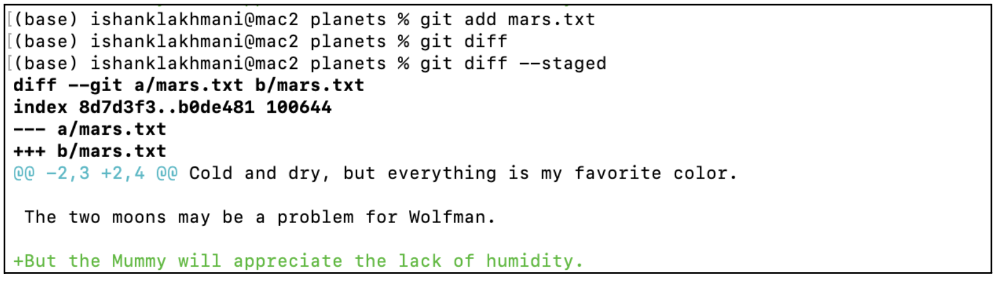

But instead if we use the command git `diff --staged`, we can see it shows the difference between the committed file and the staged file.
