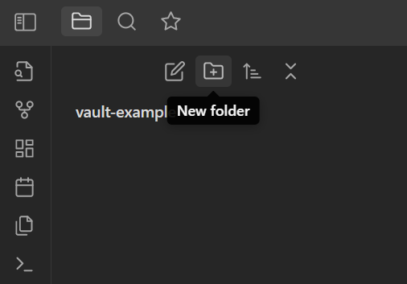
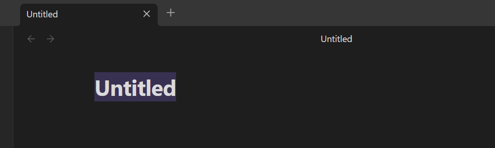

## Creating and Formatting Notes

Now that your vault is setup, it's time to start filling it up with notes!

### Creating Folders

- Select the **New Folder** icon under the **Files** tab on the left side of the window
- Name the folder "**Learning**"
- Notice that the folder has a drop-down icon, which will expand/collapse your view of all files in the folder



### Creating Notes

There are several options to create a note:

- Press <kbd>Ctrl</kbd>+<kbd>N</kbd> for Windows or <kbd>Cmd</kbd>+<kbd>N</kbd> for macOS on your keyboard
- Select the **New Note** icon in the upper left corner
- Right-Click on an existing folder and select the **New Note** option


Practice making a few notes using each of these methods. Be sure to give each note a name! You may notice that once a new note is created, it's opened showing the title highlighted at the top. The title will appear at the top of each note, which makes it very easy to update.



For the next section, make a new note in the "**Learning**" folder, and name it "**Markdown Practice**". You will use this note to practice formatting text by writing Markdown.

> [!Note] ### Organizing Notes
> It is very easy to organize your notes in the file manager. Notes are displayed in alphabetical order by default, but you can change this by selecting the sort icon at the top. If you want to move notes in and out of folders, you can simply click and drag them to the desired destination.

## Formatting Notes with Markdown

Notes are useful as long as they contain information that is important to you. However, a reasonable amount of formatting could help convery this information and help you review your notes more efficiently. This section will outline several formats you can add to your notes with simple Markdown syntax. Write these examples in the note **Markdown Practice**, and notice that the formatting renders immediately.

### Headings

``` markdown
# Heading 1
## Heading 2
### Heading 3
#### Heading 4
```

# Heading 1
## Heading 2
### Heading 3
#### Heading 4


### Emphasis

``` markdown
*This text is italic*
**This text is bold**
```

*This text is italic*
**This text is bold**

### Lists

#### Bullet List

``` markdown
- item 1
- item 2
- item 3
	- item 3a
	- item 3b
```

- item 1
- item 2
- item 3
	- item 3a
	- item 3b

#### Numbered List

```markdown
1. item 1
2. item 2
3. item 3
	1. item 3a
	2. item 3b
```

1. item 1
2. item 2
3. item 3
	1. item 3a
	2. item 3b

### External Links

Format text in your note to have links:

```markdown
[Obsidian](http://obsidian.md)
```

[Obsidian](http://obsidian.md)

```markdown
Here is a sentence that tells you to learn more tools on our [Workshop Website](https://cmu-lib.github.io/portfolio_workshop/)!
```

Here is a sentence that tells you to learn more tools on our [Workshop Website](https://cmu-lib.github.io/portfolio_workshop/)!

### Embed Images

#### Image from a URL

``` markdown

```


#### Image from your vault

```markdown
![[obsidian-logo.png]]
```


#### Resizing an image

```markdown
![[obsidian-logo.png|100]]
```


### Blockquotes

```markdown
> "As human beings, our job in life is to help people realize how rare and valuable each one of us really is, that each of us has something that no one else has- or ever will have- something inside that is unique to all time. It's our job to encourage each other to discover that uniqueness and to provide ways of developing its expression"
>
> - Fred Rogers
```

> "As human beings, our job in life is to help people realize how rare and valuable each one of us really is, that each of us has something that no one else has- or ever will have- something inside that is unique to all time. It's our job to encourage each other to discover that uniqueness and to provide ways of developing its expression"
>
> - Fred Rogers

### Displaying Code

It is very simple to display examples of code in a variety of languages. You can even display Markdown. Code can be displayed either inline with your text or as a code block.

#### Inline Code

```markdown
Inline code is displayed like this: `display.inline(type = "code")`
```

Inline code is displayed like this: `display.inline(type = "code")`

#### Code Blocks

``` markdown
message = "Hello World"
print(message)
```

``` python
message = "Hello World"
print(message)
```

### Task Lists

Create an interactive task list in your note, which lets you check off completed tasks:

``` markdown
- [x] done task
- [?] task done but still want to view
- [ ] not done
```

- [x] done task
- [?] task done but still want to view
- [ ] not done

### Tables

``` markdown
Column 1|Column 2|Column 3
---|---|---
Item 1a|Item 2a|Item 3a
Item 1b|Item 2b|Item 3b
```

Column 1|Column 2|Column 3
---|---|---
Item 1a|Item 2a|Item 3a
Item 1b|Item 2b|Item 3b

Tables can sometimes be tedious to make. In the section about Plugins, we will discuss a community plugin that helps streamline making tables.

### Displaying Equations

Markdown allows you to easily display equations written with $\LaTeX$.

#### Inline Equations

```markdown
Provide an equation like $e^{2i\pi} = 1$ in line with your text.
```

Provide an equation like $e^{2i\pi} = 1$ in line with your text.

#### Equation Blocks

``` markdown
$$
\begin{vmatrix}a & b\\ c & d \end{vmatrix}=ad-bc
$$
```

$$
\begin{vmatrix}a & b\\ c & d \end{vmatrix}=ad-bc
$$

### Callouts

Display a callout to emphasize a section of information:

```markdown
>[!Info] Callouts
>You can type `info`, `notes`, `tip`, and other things in the brackets
>
```

>[!Info] Callouts
>You can type `info`, `notes`, `tip`, and other things in the brackets
>

### Embedding Files

Easily embed files in your vault like PDFs:


