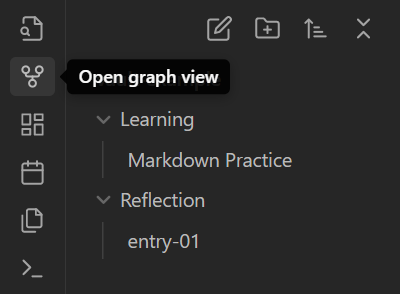
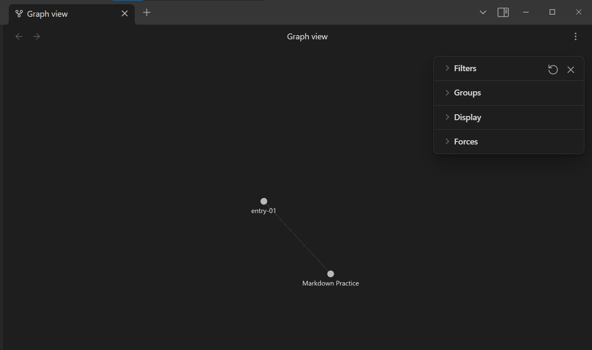
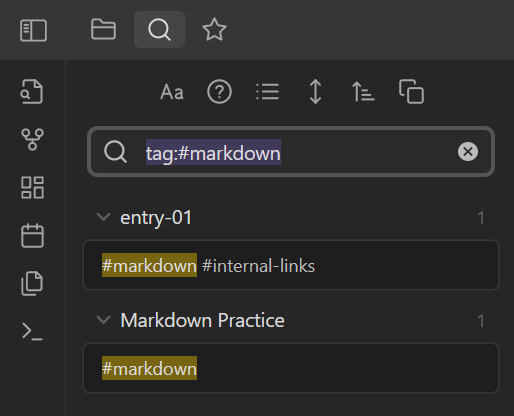
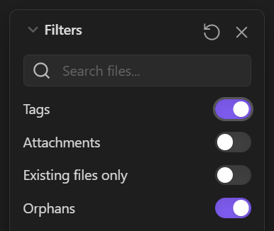
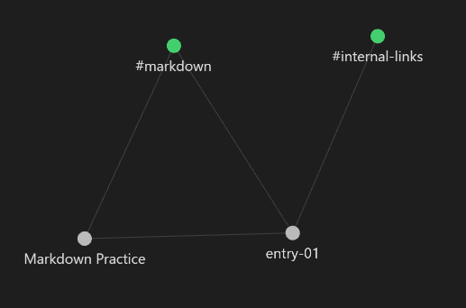
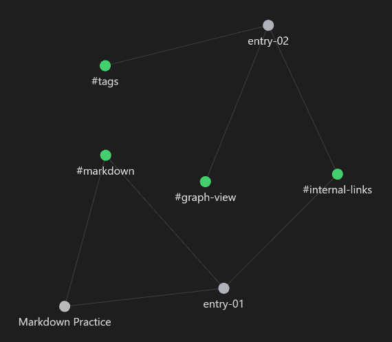

## Linking Notes and Visualizing Connections

Our thoughts, ideas, and work are all interconnected, so why can't our notes be as well? Obsidian makes it incredibly easy to connect our notes and search for notes based on related concepts.

### Internal Links

Now let's make more notes and see how we can make connections.

- Create a new folder in your vault called **Reflection**
- Open a new note in this folder called **entry-01**
- Type some text about your experience learning Markdown, and make a reference to the note **Markdown Practice** like this:

```markdown
In the prior lesson, I learned how to make lists, embed images, and other useful formats.

I practiced writing Markdown in my [[Markdown Practice]] note, inside my vault.
```

Notice that a link to **Markdown Practice** forms. Now you can quickly access this note by selecting the link. This feature is very helpful and convinient, and that's not the only benefit. Now these two notes have a relationship that Obsidian uses to help you visualize and find notes.

## Graph View

Graph view let's you visualize the relationships between your notes in your vault. To access this feature, select the graph view icon that is second from the top on the left pane:



A window should open that looks like this:



This is the Graph View in Obsidian. You will see circles (or nodes) that represent your notes. There should be two nodes for **Markdown Practice** and **entry-01**. Notice that these two nodes are connected by a line. Connecting lines represent internal links between notes. Since you made a reference to **Markdown Practice** in **entry-01**, a connection was created in this graph.

As you create more notes, and make more internal links, this network will expand with more nodes and connections branching out along your vault. As a note develops more connections, the node size will increase. This will make it very easy to visualize what notes, or ideas, are more prominent in your vault. Eventually, your graph may look something like this (taken from [here](https://help.obsidian.md/Obsidian/Index)):


### Customizing your graph

There are several tools in the Graph View window that lets you customize the appearance and layout of your graph. Take a few minutes to play with these tools.

## Tags

You can also add #tags to your notes! Tag your notes with certain subjects or themes that you anticipate will come up often. Just type `#` and add a brief, but descriptive name for your tag. That's can go anywhere, like the middle of a sentence, in a heading, or simply at the top of your note.

Let's tag your existing notes:

- Start with **Markdown Practice**. Since this note is obviously about markdown, add #markdown to the top of the note
- Next, in **entry-01**, also add #markdown since markdown was also mentioned here
- Finally, add one more tag to **entry-01**. Since you created your first internal link in this note, also add #internal-links

### Finding notes with tags

So what are these tags good for? Click on one to find out! (Hint: click on #markdown in **entry-01**)



When you select a tag, the search tab will open with a tag search string populated in the search bar  (eg. `tag:#markdown`). Underneath, the results show a list of each note that contains the tag and shows a preview of where the tag is located in the note. This function can be extremely useful when you have hundreds of notes, and you want to find a past note that mentions a specific topic.

### Tags in graph view

Now go back to the graph view window and see how tags can enhance this experience. Open up **Filters** and turn on the toggle switch for Tags.



Now graph view should look like this:


You can now visualize the connectivity between your notes and the tags within those notes. Even with few notes in your vault, you can already see intricate connections. #markdown is connected to both notes, since it was written in each, however, #internal-links is only connected to one note.

Let's make your vault, and the connections within your vault, a little more interesting. Create a new note in your **Reflection** folder called "**entry-02**" and add the following text:

``` markdown
In my next lesson, I learned about #internal-links, #graph-view, and #tags.
```

Now you've added a couple more tags, and referenced an existing one. Graph view should now look even more different than before.


Now **entry-02** is included in your network of notes, and it's connected to three tags. This note doesn't contain internal links to other notes, so no connections were drawn. However, **entry-01** and **entry-02** are both connected to #internal-links! Although there wasn't an internal link explicitly made between these two notes, their shared relationship with a tag shows an indirect connection! Visualizing connections in this way may help you identify common themes between your notes that you may not have realized.

So now that your vault has new tags, you may be wondering how you can keep track of them all. Open up the right pane of your Obisidian and select the **Tags** tab.


This will display a list of all existing tags in order of most to least frequently used. Notice that a count is shown next to each tag. You can also change the sort order if you prefer alphabetical. You can select a tag from this list to search notes containing the tag, exactly like the results shown earlier in this lesson.
