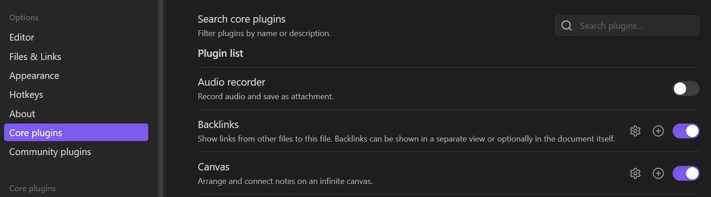
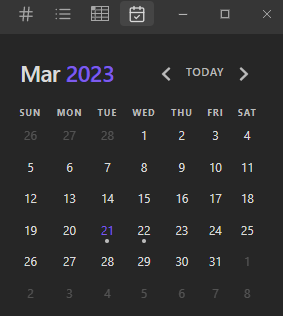
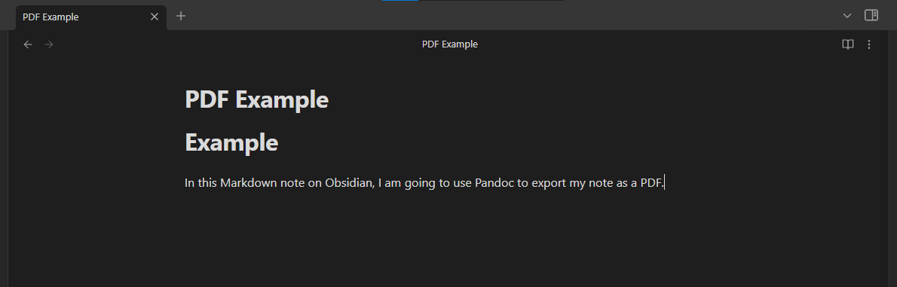
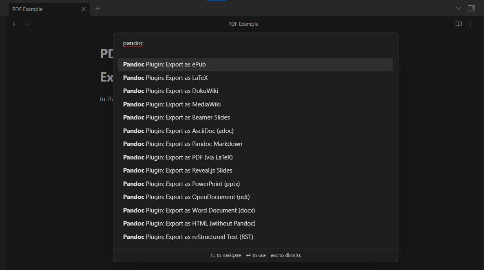
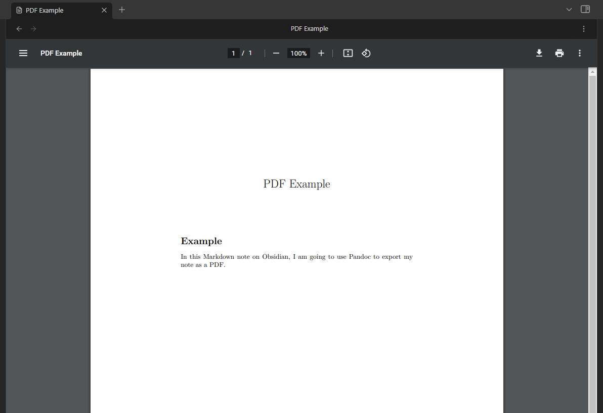

## Enhancing Your Obsidian Vault with Plugins

The next piece that makes Obsidian super powerful and customizable is the vasy selection of plugins! There are two types of plugins: core and community. 

### Core Plugins

These are plugins that come pre-installed with Obsidian. With newer versions, it's likely that this list of plugins will continue to grow. Many are already enabled in your vault. You can view what you have and control their settings by opening the **Settings** window and selecting the **Core plugins** tab.

Take a moment to explore these plugins! See how to use them and find out what happens when they become enabled.

### Community Plugins

Obsidian is community-driven. With this platform, you aren't subjected to the basic tools that come with your initial install. Tons of other Obsidian users are creating their own plugins that you can easily install (you could even create your own plugin!).

To get started, open the **Settings** window and selecting the **Community plugins** tab. First, you will have to turn on Community Plugins by exisitng **Restricted Mode** in Obsidian. With all public products we access from the internet, there is a risk to our the security and privacy of our data and usage. Obsidian makes it's best effort to review and monitor the integrity of all community plugins. This is assuring to know as you browse plugins, but always use your best judgement before installing a plugin and make sure that the documentation is detailed and transparent about what the plugin does.

Once you turn on Community Plugins, you will see the following options under this tab. Notice that you can turn Restricted mode on at any time.

You can start browsing community plugins by selecting **Browse.** This list will likely be overwhelming! Don't think that you need to install a ton of plugins right away. It's best to work with Obisidian with limited modifications and when you reach a point where you're telling yourself, "I wish I had a better way to do this," then it's time to look for a plugin! It's very likely that someone encountered the same problem and wrote their own plugin.

But rest assured, here's a short list of some helpful plugins that may help you get started:

#### [Advanced Tables](https://github.com/tgrosinger/advanced-tables-obsidian)

Writing tables in Markdown can be somewhat tedious, especially if you wish to create a large table. This plugin makes it much easier to create a table and offers many tools and functionalities found in Microsoft Excel. These include:

- Navigating between rows and columns with tab/enter
- Aligning text in cells
- Sorting rows based off of a column
- [Entering formulas](https://github.com/tgrosinger/advanced-tables-obsidian/blob/main/docs/help.md#using-formulas-in-markdown-tables)

#### [Calendar](https://github.com/liamcain/obsidian-calendar-plugin)

Obsidian has a tool on the left panel that lets you **Open today's daily note**. This automatically creates a note titled with the today's date (YYYY-MM-DD). Once the note is created, you can select the tool again to open today's daily note at any time. The Calendar plugin helps you manage your daily notes further.

This plugin provides a calendar that you can display on a side bar in your Obisidian window. This offers you a visual to see where you have created daily notes, and you can select any date to access or create the daily note for that day (you can even create notes for future dates). This calendar will also help show you how much you wrote each day. The number of "dots" that appear under a date will tell you how many words you wrote in your daily note.

#### [Dictionary](https://github.com/phibr0/obsidian-dictionary)

This plugin offers you a dictionary immediately at your disposal. Use this tool to open on your side bar a dictionary entry for a word with pronunciation. This tools offers several dictionaries and multiple languages. Additionally, you can enable a feature that lets you receive suggestions for synonyms of highlighted words.

#### [Pandoc](https://github.com/OliverBalfour/obsidian-pandoc)

This plugin lets you export your Markdown notes in Obisidan to a variety of formats. Some of these formats include: PDF, HTML, LaTeX, Word Document, and even Jupyter Notebook. To export a note, open the command pallete with <kbd>Ctrl</kbd>+<kbd>p</kbd>/<kbd>Cmd</kbd>+<kbd>p</kbd> and type "pandoc." From there, you can choose your export format, and the export file will be in your vault!

**Create a note:**

**Call Pandoc**:

**Find the exported file in your vault:**

