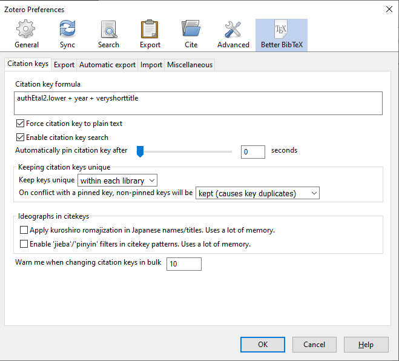
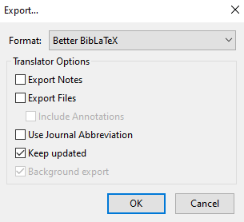
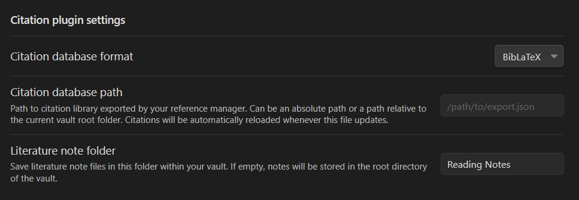

# Syncing Your Zotero Collection with Obsidian

Now that we've discussed how to manage notes and improve your vault with plugins, this lesson will outline a workflow to enhance your process in taking notes for research. When we find ourselves writing documents for research, reference managers help us keep track of the publications we cite in our writing. Over time, you may likely accumualte notes about each publication you read, and it's possible to find yourself in a mess to keep track of which notes belong to which reference.

With the [Citations](https://github.com/hans/obsidian-citation-plugin) plugin, you can easily create notes that are linked to items in your Zotero collection. With all the other functionalities in Obsidian, you can then link these notes to notes about other references, categorize them with tags, and visualize the connections between your notes with the graph view!

# Setting up Zotero

## Better BibTeX

- First, make sure to [download Zotero](https://www.zotero.org/download/) if you have not already
- Then follow [these instructions to install Better BibTeX](https://retorque.re/zotero-better-bibtex/installation/). Be sure to restart Zotero so that all changes are applied
- In Zotero, go to Preferences (`Edit>Preferences`). There will be a tab for Better BibTex in this window
- With Better BibTeX, you can edit a **Citation Key** that labels each reference in your library. You will see later in this lesson that this key will be the title for the note that you create for a reference. Here is an example of a citation key formula you can use: `authEtal2.lower + year +veryshorttitle`. This will produce a citation key with the last name of the first author (plus the second author, if only two authors, or "etal" for larger author lists), the year, and the first word from the title of the publication.

## Exporting your library to Obsidian

Now let's export your Zotero library (via Better BiBLaTeX) to a file in your vault.

- Select `File > Export Library...` and in the Export window, select **Better BibLaTeX** for the format.
- Select `Keep updated` so that your collection is automatically re-exported each time you make changes
- Save your exported file somewhere inside your vault

# Citations Plugin

Now you can install **Citations** and make notes for articles in Zotero. Once you do, make the following changes in the settings:

- Change the **Citation plugin settings** to **BibLaTeX**
- Provide the path to the file for your exported library
- Specify a folder to store your literature notes. It's good to have a dedicated folder for these notes  so that they don't clutter your vault

Now you're ready to use Citations! The controls are simple:

## Open or create a literature note

- Open or create a literature note by pressing <kbd>Ctrl</kbd>+<kbd>Shift</kbd>+<kbd>O</kbd>.
- A search bar will open that will let you find the reference in mind. Select the reference to create/open the note. 
- The name of the note will be the same as the citation key listed in Zotero, and the note will have a preamble with metadata about the reference (eg. Title, Authors, Year)

## Link to a literature note

- Create an internal link to a literature note inside of a different note by typing <kbd>Ctrl</kbd>+<kbd>Shift</kbd>+<kbd>E</kbd>.
- Again, a search bar will come up, which you can use to find the reference in mind.
- If a literature has not been created yet, it will also be created for you.

# Organize and categorize your literature notes!

Now that you have literature notes, spend time to go through them, create links to other notes, and give them tags for different topics!
