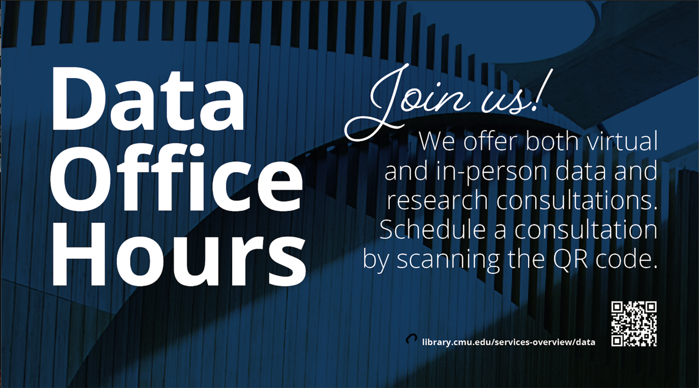

# Open Data Science Workshops
Hosted by the Open Science program within the
[Carnegie Mellon University (CMU) Libraries](https://www.library.cmu.edu/)

This website highlights workshops from CMU libraries that help
build computational skills for Open Research and Data Science.

## Data Office Hours

Schedule a [Data Consultation](https://library.cmu.edu/service/data-office-hours) with our library associates for support with data and research!

## Coordinators

Melanie Gainey (she/her/hers)  
Open Science Program Director/Librarian  
Office: Library 431, Mellon library  
[mgainey@andrew.cmu.edu](mailto:mgainey@andrew.cmu.edu) | [Schedule a Consultation](https://cmu.libcal.com/appointment/42420)

Chasz Griego (he/him/his)  
Science and Engineering Librarian  
Office: 4410, Sorrells Library  
[cgriego@andrew.cmu.edu](mailto:cgriego@andrew.cmu.edu) | [Schedule a Consultation](https://cmu.libcal.com/appointments/cgriego)

Emma Slayton (she/her/hers)  
Data Curation, Visualization, and GIS Specialist  
Office: 4408, Sorrells Library  
[eslayton@andrew.cmu.edu](mailto:eslayton@andrew.cmu.edu) | [Schedule a Consultation](https://cmu.libcal.com/appointment/41060)

Sarah Young (she/her/hers)  
Principal Librarian  
Office: 109G, Hunt Library  
[sarahy@andrew.cmu.edu](mailto:sarahy@andrew.cmu.edu) | [Schedule a Consultation](https://cmu.libcal.com/appointments/sarahy)

Emily Bongiovanni (she/her/hers)  
Psychology Librarian Liaison  
Office: 109D, Hunt Library  
[ebongiov@andrew.cmu.edu](mailto:ebongiov@andrew.cmu.edu) | [Schedule a Consultation](https://cmu.libcal.com/appointments/emily)  

Di Yoong (they/them/theirs)
Social Sciences Librarian
Office: 109F, Hunt Library
[dyoong@andrew.cmu.edu](mailto:dyoong@andrew.cmu.edu) | [Schedule a Consultation](https://cmu.libcal.com/appointments/dyoong)
