# Exploring Files and Directories

### What is Command Line?
Command line interface, command prompt, command screen, terminal, text interface, and shell are all instances that refer to an environment that receives commands from a user in the form of text. Using the command line interface is an alternative method for interacting with your computer than the commonly known approach, using a mouse to point and click on a computers graphical user interface (gui).

### Why use Command Line?
Because it makes it easier to automate tasks and often it requires fewer steps to implement! As with everything, there is a small learning curve but there are online manuals for users to reference and a help option to review details of a command.

### General Syntax

  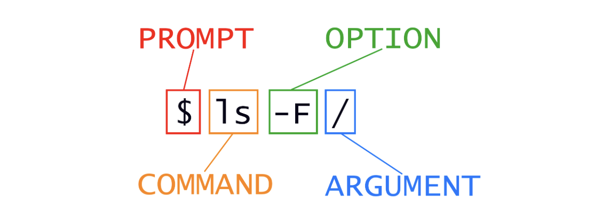

Let’s get started!
When the shell is first opened, you are presented with a $ prompt, indicating that the shell is waiting for input. Shell typically uses `$` as the prompt.

  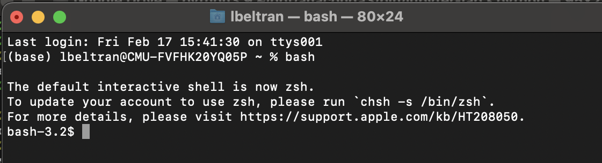

### Print Working Directory
At anytime to find out where you are in your command line interface, you can type `pwd`. `pwd` stands for **print working directory** and can be thought of as places.

Commands mostly read and write files in the current working directory, i.e. ‘here’, so knowing where you are before running a command is important.

  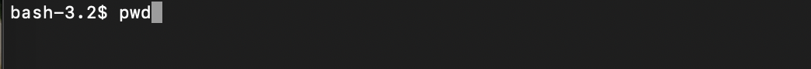

I'm currently in my home directory.

  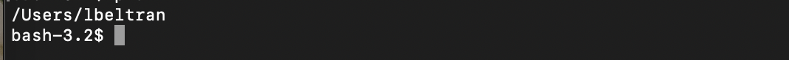

Your home directory might be different depending on your operating system:

For Linux users it may look like:
~~~
$  /home/lbeltran 
~~~

And for Microsoft users it may look like:
~~~
$  C:\Documents  \Settings\lbeltran
~~~
or even this:
~~~
$  C:\Users\lbeltran
~~~

### Understanding File Directories
Let's take a quick tour of what a filesystem looks like:

  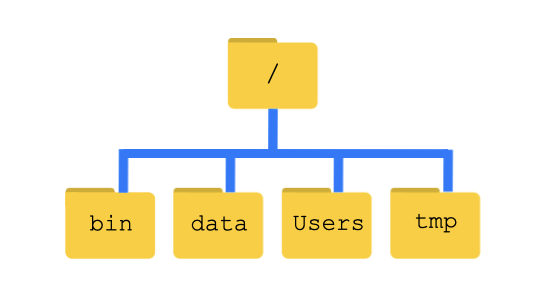

`/` character represents the root directory on its own. So this is the leading slash in my /Users/lbeltran

In the image above you'll see there are four directories below the root directory which are: `bin`, `data`, `Users`, and `tmp`

To see the directories in your root directory you can write the following command:
~~~
$ cd /
~~~
We know our current working directory /Users/lbeltran is stored within the `/Users` directory and that the `/Users` is stored inside the root directory because it begins with `/`

As you can see that bash depends on your files being organized in a Hierarchical system. You can put tons of files on your home directory but this is equivalent to putting a ton of papers on your desk.

### Lists
Let's try our first command,ls. `ls` is short for list. This command will give you a list of all your contents in your current working directory.

  

After typing in `ls` press `enter` or `return` and you'll get a list of your contents.

  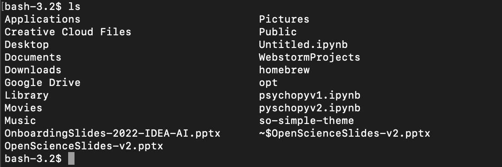

If you are not sure if a content is a directory or a file you can type ls -F and if it has a trailing / then it's a directory.

other markers @ indicates a link `*` indicates an executable

### Getting help
You can learn more about a command by using the `--help` command or using the man command. Again, depending on which operating system you are using one of these may not be supported. For example `--help` is not supported on my MacOS, but if I type `help` it is and so is `man`. Let's take a look.
~~~
$ --help
~~~

  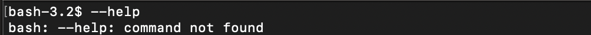

~~~
$  help
~~~

  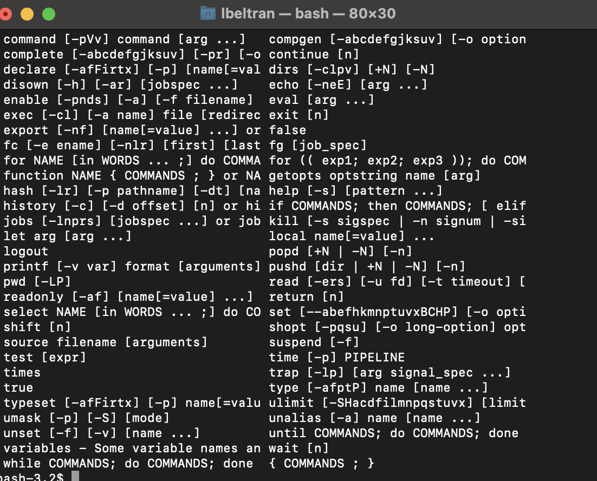

~~~
$  man ls
~~~

  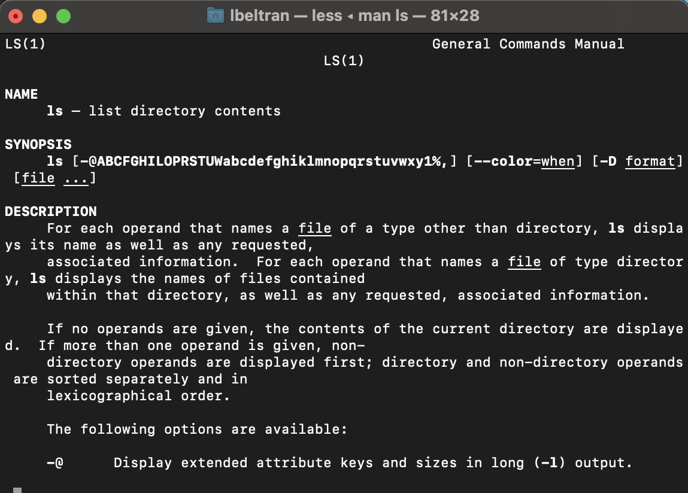

Tips for navigating `man`  pages
You can navigate through the man pages in a number of ways:

**1. Move line by line** ↓ and ↑

**2. Skip up and down by full page b and Spacebar**

**3. To search for a character or word** / followed by the character or word

If search results in multiple hits you can mov between hits using `n` (to move forward) and `shift+ n` (to move backward)

Press `q` to quit the `man` pages

### Exploring other Directories
To list and explore other directories without actually moving to that directory you can use `ls` **command**, `-F` **option** and an **argument** `Desktop`

  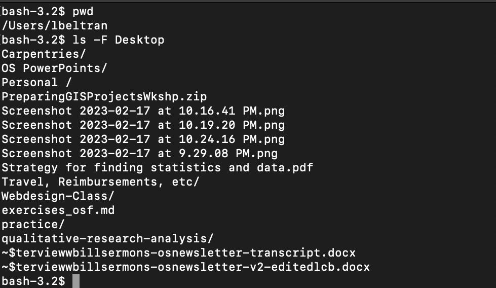

### Moving down the directory tree
We can change our location to a different directory to go down the directory tree by using the `cd` command - which stands for change directories - following the directory name you want to change your working directory to. You can think of `cd` as double clicking a folder on your desktop or file explorer to get into that folder.

So for example, if we want to get to the exercise folder, on our desktop, we can go down the directory tree to get there doing the following:

  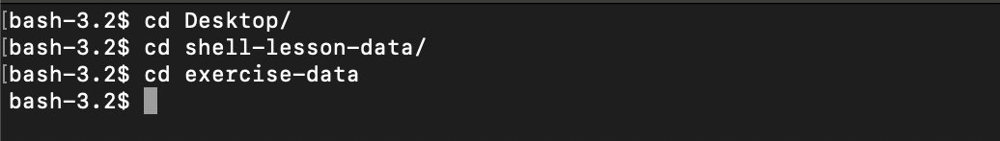

  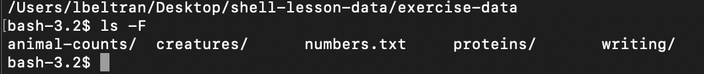

An alternative method of moving down is `cd -` which will move you back to the previous directory you were in. **Tip**: if you do `cd -` twice it will take you back to the starting directory.

### Moving up the directory tree
Thecd command will let you see sub-directories inside your current working directory, but `cd` won't allow you to see directories above our current location.

A couple of strategies to move up one directory are:

~~~
$ cd ..
~~~

~~~
$ cd ~
~~~
