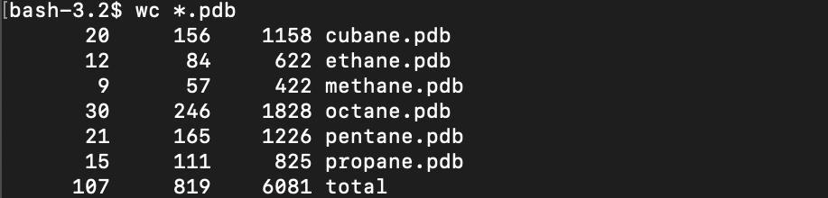
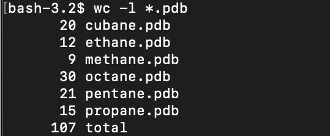
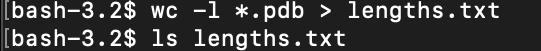
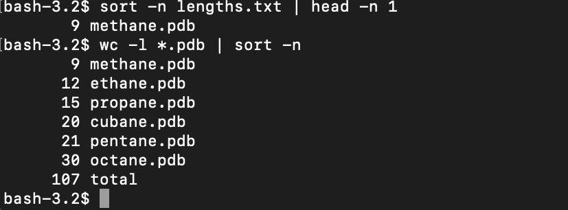
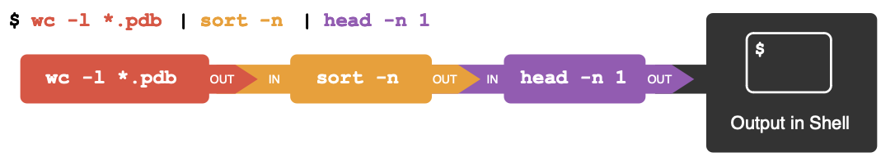

# Pipes & Filters

### Combining commands

#### Word Count
`wc` is the ‘word count’ command: it counts the number of lines, words, and characters in files (returning the values in that order from left to right).

  

If we run the command `wc *.pdb`, the `* in *.pdb` matches zero or more characters, so the shell turns `*.pdb` into a list of all `.pdb` files in the current directory:

  

The above command `*.pdb` will show the total number of **all** lines in the last line of the output. To show only the number of lines per file you can type:

~~~
$ wc -l *.pdb
~~~

  

Other commands using `wc`

To show only the number of characters:
~~~
$ wc -l *.pdb
~~~
To show only the number of words

~~~
$ wc -w *.pdb
~~~

### Filtering outputs

#### Sort
The `sort` function will print the output of a file in a specific order, which is helpful when reading the data.

By default the `sort` command sorts files assuming the contents are in ASCII, but there are many options, like `-n` that can be used with the command to sort the data in a particular way. A few options include:

`-n` uses the numerical value to sort

~~~
$ sort -n
~~~

`-r` reverses the sorting order

~~~
$ sort -r
~~~

`-b` ignores blanks at the start of the line

~~~
$ sort -b
~~~

### Capturing outputs

#### Redirects
If you want to see which of your files contains the fewest lines you can run the command `>`. This tells the shell to redirect the command's output to a file instead of printing it to the screen. Let's try it out by typing the following command:

~~~
$ wc -l *.pdb > lengths.txt
~~~

In the command we used the `>` to redirect the content that the `wc` command would have printed to a new file named `lengths.txt`. To check the file exists type `ls lengths.txt` command.

  

**Note:**

When using the redirect command, if the file doesn't already exist, then shell will create the file and put the content into the new file. However, if a file does exists, then it will be overwritten, which could lead to data loss.

It's not a good idea to redirect the output of a command that operates on a file to the same file as it could lead to incorrect results and/or delete the contents in the file. For example, best practice is to ***avoid*** doing something like the following:

~~~
$ sort -n lengths.txt > lengths.txt
~~~

#### Joining and Printing outputs
Use `cat`, short for concatenate, to join and print the contents of files one after another. For example:

~~~
$ cat lengths.txt
~~~

Passing output using pipes
You can use a vertical bar `|`, called a **pipe** between two commands to tell shell you want to use the output of the command on the left as the input to the command on the right. This looks like:

  

Combining multiple commands
We can also use the `pipe` command to consecutively chain pipes, which makes the need for intermediate files unnecessary. In the following example, we are asking shell to send the output of `wc` word count directly to `sort`, and then send the resulting output to `head`. Let's break it down.

  

  

  

  

***Tip***: you can think of it like nesting functions in mathematics!
