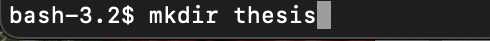
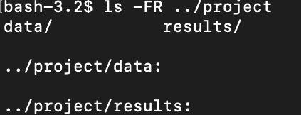
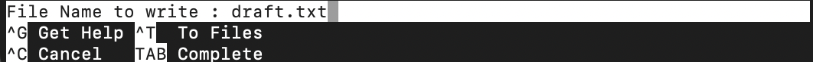
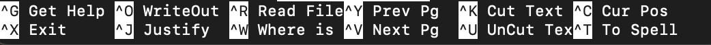
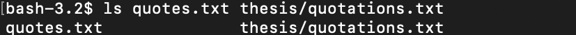
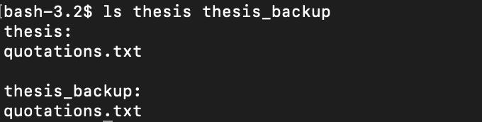

# Working with Files and Directories

### Creating directories
There are two ways of creating a directory. The first way is using your computer's graphical file explorer, and the second creating a directory in the shell. Both methods accomplish the same task.

You can create a new directory by using the command `mkdir` which means 'make directory'.

  

It's possible to create a directory with nested subdirectories in a single operation using the option `-p` with your `mkdir` command.

  

To be sure the nested subdirectories were created in your directory hierarchy, type `ls -FR` and directory name. See example below:

  

### Creating text files using a text editor
There are several powerful and flexible text editors, but whichever one you choose to use, it's good to know where the editor searches and saves files.

nano is an editor that works only with plain character data (i.e., no tables, images, etc.)

To create a text file using nano, run the text editor nano and type a filename.

  

This will take you into the nano text editor. Once text has been written press **control+ o** or **Ctrl+o**. You will be asked to provide a namefor the file that will contain your text. Then press **Return** or **Enter** to accept.

  

  

  

Once the file is saved, to quit the editor and return to the shell use **control+x** or **Ctrl+x**

  

  
**Tip**: make sure you are in the working directory you want the text file to be created in.

### Move files and directories

To change a **file or directory** name you can use the `mv` command, which is short for move

  

  

The first argument `thesis/draft.txt` tells mv what we are moving, while the second argument `thesis/quotes.txt`. This is essentially the same as renaming a file.

**Note**: using the `mv` command will overwrite any existing files with the same name, which can lead to data loss. To cause `mv` to request a confirmation, add `-i` option.

~~~
$ mv -i thesis/draft.txt thesis/quotes.txt
~~~

The mv command can also move files to different directories.
To change a file or directory name you can use the mv command, which is short for move

  

  

### Copy files and directories
To create a copy of a file or directory, you can use the `cp` copy command. The cp command works similarly to mv except that you are creating a copy rather than moving or renaming it.

  

  

  

  

To create a back up of a directory, you can use a recursive option `-r`. This will create a copy of a directory and all its contents.

  

  

  

  

### Remove files and directories
Command Line makes it simple to remove files and tidy up a directories using the `rm` command, short for remove. To remove directories you can you add the recursive option `-r`, which would look like `-r rm`.

**Note**: when you use the `rm` or `rm -r` commands it permanently deletes a file or directory. It does not go into a trash bin. To make sure you want to remove a file you can add the interactive option `-i`.

Safely remove a file:
~~~
$ rm -i
~~~

Safely remove a directory:
~~~
$ rm -r -i
~~~

### Wildcards
Wildcards are special characters `*` and `?` that prompt shell to create a list of matching filenames before running a command. Using wildcards can be helpful when trying to access multiple files at once.

`*` represents zero or more other characters. For example, `*ethane.pdb` would match both `ethane.pdb` and `methane.pdb`

`?` represents exactly one character. For example, ?ethane.pdb would match only `methane.pdb` and ***not*** `ethane.pdb`
